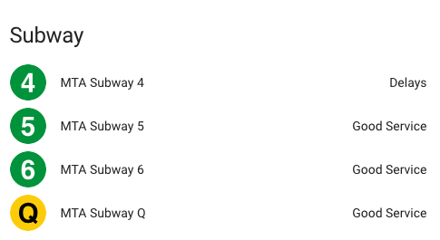
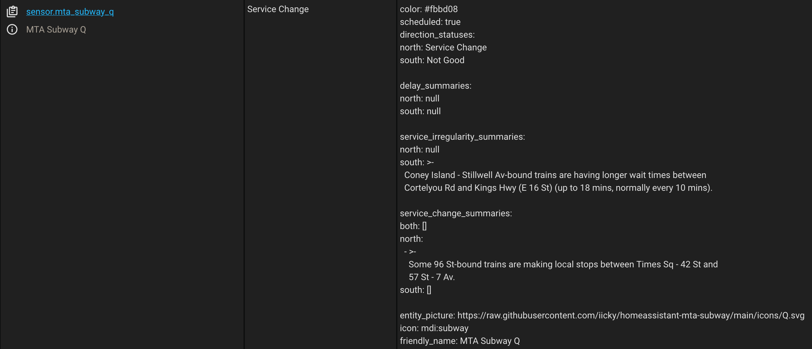

# Home Assistant MTA Subway Service Status Sensor

## Overview

A sensor to provide MTA Subway service statuses for Home Assistant. The sensor reads from the offical [MTA Service Status](http://web.mta.info/status/ServiceStatusSubway.xml) XML feed and provides both the overall line status as a sensor state as well as status descriptions as sensor attributes. The train line states are updated every minute from the MTA feed.

### Sensor States
- Good Service
- Delays
- Planned Work
- Service Change



### Sensor Attributes

**Direction 0 State**
Indicates the subway line state in either the North or East direction (*direction in undocumented, but this is my best guess*).

**Direction 1 State**
Indicates the subway line state in either the South or West direction (*direction in undocumented, but this is my best guess*).

**Delays Description**
A full description of why the line is delayed.

**Service Change Description**
A full description of the changes to the line service.

**Planned Work Description**
A full description of any planned work currently occuring on the line.



## Installation

To install the sensor, copy the `mta_subway.py` script to a directory called `custom_components/sensor` in your Home Assistant configuration directory.

To install the offical MTA line icons, copy the `www` directory and all `svg` files to your Home Assistant configuration directory.

To use, add the following configuration to your `configuration.yaml` file for Home Assistant, removing any lines that you do not want to monitor:

```
sensor:
  - platform: mta_subway
    line:
      - 1
      - 2
      - 3
      - 4
      - 5
      - 6
      - 7
      - A
      - C
      - E
      - B
      - D
      - F
      - M
      - G
      - J
      - Z
      - L
      - N
      - Q
      - R
      - W
      - S
      - SI
```
